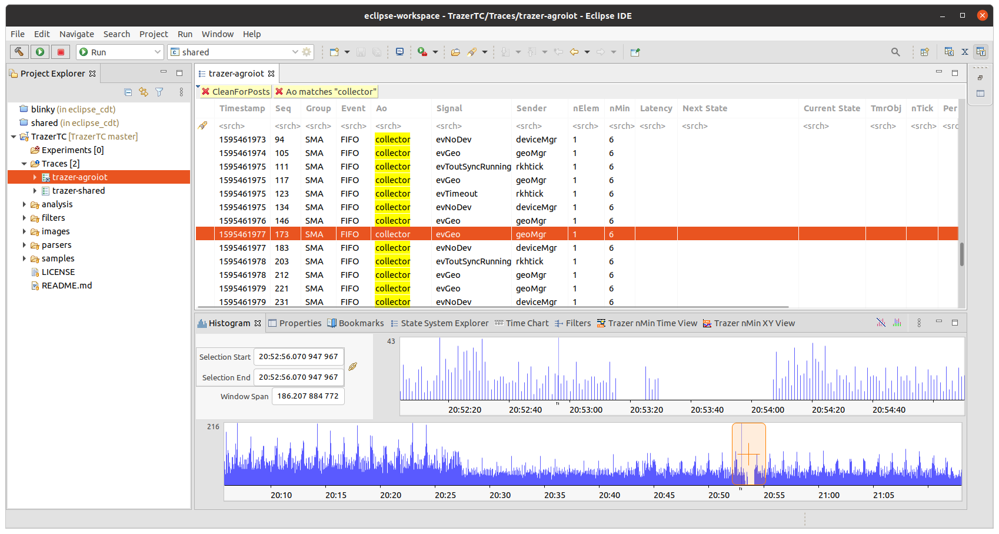

# TrazerTC
Trace Compass Examples for Trazer

## Contents
- [Overview](#overview)
- [Trace Compass Documentation](#trace-compass-documentation)
- [Before to start](#before-to-start)
- [Using Trace Compass with Trazer](#using-trace-compass-with-trazer)
- [Updating a XML analysis](#updating-a-xml-analysis)
- [Updating Trazer parser](#updating-trazer-parser)
------------------------------------------------------------------------------
## Overview
This repository provides a simple guide to use the powerful [Trace Compass](https://www.eclipse.org/tracecompass/) to solve performance and reliability issues by reading and analyzing traces of a reactive and embedded application based on the [RKH](https://github.com/vortexmakes/RKH) framework.

[Trace Compass](https://www.eclipse.org/tracecompass/) is an open source application for viewing and analyzing any type of logs or traces. Its goal is to provide views, graphs, metrics, etc. to help extract useful information from traces, in a way that is more user-friendly and informative than huge text dumps. 



Trace Compass allows you not only to efficiently search and filter events but also to define your own trace analysis and a way to view 
them in an XML format. The data generated by the analysis could be used to populate time graph and XY chart views. A time graph view is a view divided in two, 
with a tree viewer on the left showing information on the different entries to display and a Gantt-like viewer on the right, showing the state of the entries 
over time. Whereas an XY chart displays series as a set of numerical values over time. The X-axis represents the time and is synchronized with the trace's 
current time range. The Y-axis can be any numerical value.

The following image shows an example of XY chart, whose Y-axis is a numerical value of a specific trace 
event (`DEVMGR_BACKOFF_USR_TRACE`). The trace used, as well as the XML file are available 
in [analysis/backoff-analysis.xml](analysis/backoff-analysis.xml) and [samples/trazer-backoff](samples/trazer-backoff) respectively. 
This event has a format like that:
``` 
1596475478| [190] | USR | DEVMGR_BACKOFF_USR_TRACE : User trace information
                                  | 00002
```


## Trace Compass Documentation
- [Trace Compass User Guide](https://archive.eclipse.org/tracecompass/doc/stable/org.eclipse.tracecompass.doc.user/User-Guide.html)
- [An example of XML analysis](https://github.com/lihui7115/xml-analysis-example)
- [Analyzing Eclipse Applications with Trace Compass](https://www.eclipsecon.org/na2015/sites/default/files/slides/EclipseConAmerica2015.pdf) presentation 
of [EclipseCon](https://www.eclipsecon.org).
- Docs ([xsd](https://github.com/tracecompass/tracecompass/tree/master/tmf/org.eclipse.tracecompass.tmf.analysis.xml.core/src/org/eclipse/tracecompass/tmf/analysis/xml/core/module) files) about data driven analysis through XML 

## Before to start
To go through this tutorial, you will need:
- A recent version of Trace Compass together with an Eclipse IDE. You will need a Java JRE, at least version 7.
- A local clone of this repository
- A recent version of [Trazer](https://github.com/vortexmakes/Trazer/releases) which is a console application to capture and format 
traces from an instrumented application based on [RKH](https://github.com/vortexmakes/RKH)

## Using Trace Compass with Trazer
1. Capture a trace session of your reactive embedded application
    1. Run [Trazer](https://vortexmakes.com/rkh/trazer.html) from a terminal typing a sentence like that: `./trazer -c /dev/ttyS0 115200 8N1 -o outtraces` to capture traces from a serial port and to save them to a file
    2. Run your embedded instrumented application which uses the [RKH](https://github.com/vortexmakes/RKH) framework
1. Run an Eclipse IDE instance
2. Open __Tracing__ perspective from __Window__ > __Perspective__ > __Open Perspective__ and select __Tracing__
3. Import TrazerTC project and open the __Project Explorer__ view
4. Importing Trazer parser
    1. Select __Manage Custom Parsers...__ from the __Traces__ folder context menu
    2. Click the __Import...__ button and select a file from the opened file dialog to import the custom parser, in this case 
    [parsers/trazer-parser.xml](https://github.com/vortexmakes/TrazerTC/blob/master/parsers/trazer-parser.xml) file
4. Open a trace file generated by the first step of this guide, right-click on __Traces__ folder and select __Open Trace...__
5. Importing XML file containing analyses
    1. Select __Manage XML Analyses...__ from the __Traces__ folder context menu
    2. Click the __Import__ button and select a file from the opened file dialog to import an XML file containing an analysis, in this case from
    [analysis](https://github.com/vortexmakes/TrazerTC/blob/master/analysis) folder. The file will be validated before importing it and if successful, 
    the new file will be enabled and its analyses and views will be shown under the traces for which they apply.
6. Opening a trace using Trazer parser
    1. Select a trace in the __Project Explorer__ view
    2. Right-click the trace and select __Select Trace Type...__ > __Trazer__ > __Parser__
    3. Double-click the trace or right-click it and select __Open__. The trace will be opened in an editor showing the events table, and an entry will 
    be added for it in the Time Chart view
7. Importing trace filters
    1. Open __Filters__ view
    2. Click __Import filters__ button and select a file from the opened file dialog to import an XML file containing trace filters, in this case from
    [filters](https://github.com/vortexmakes/TrazerTC/blob/master/filters) folder.

## Updating a XML analysis
If there are corrections to make, you may modify the XML state provider (trace data analysis) file, and re-import it. To re-run the analysis:
1. Select a trace in the __Project Explorer__ view
2. Right-click the selected trace and select __Delete supplementary files...__ and then click the __OK__ button. The supplementary file deletion will
have closed the trace, so it needs to be opened again to use the newly imported analysis file

## Updating Trazer parser
1. Open the __Project Explorer__ view.
2. Select __Manage Custom Parsers...__ from the __Traces__ folder context menu, or from a trace's __Select Trace Type...__ context sub-menu.
3. Select Trazer parser from the list and click the __Edit...__ button to launch the __Edit Custom Parser__ wizard.
4. Once parser has been edited, export it. To do that, select Trazer parser from the list, click the __Export...__ button and enter or select a file in the opened file dialog to export the Trazer parser. Note that if an existing file containing custom parsers is selected, the custom parser will be appended to the file. 
